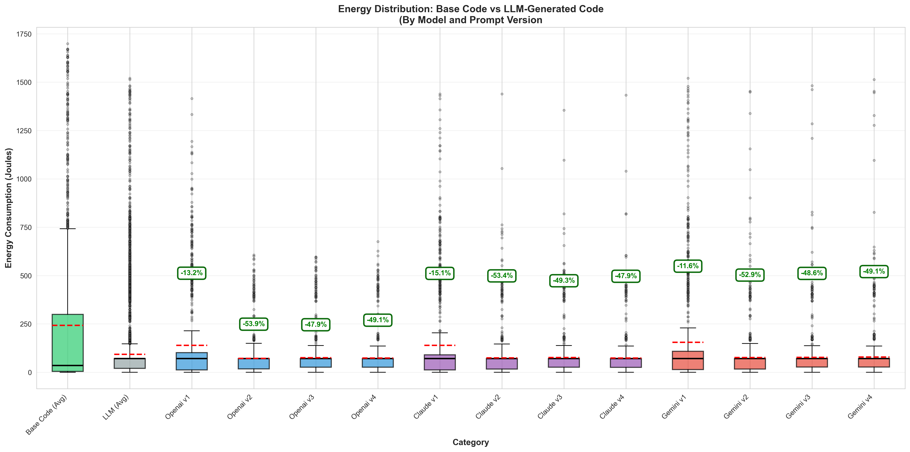
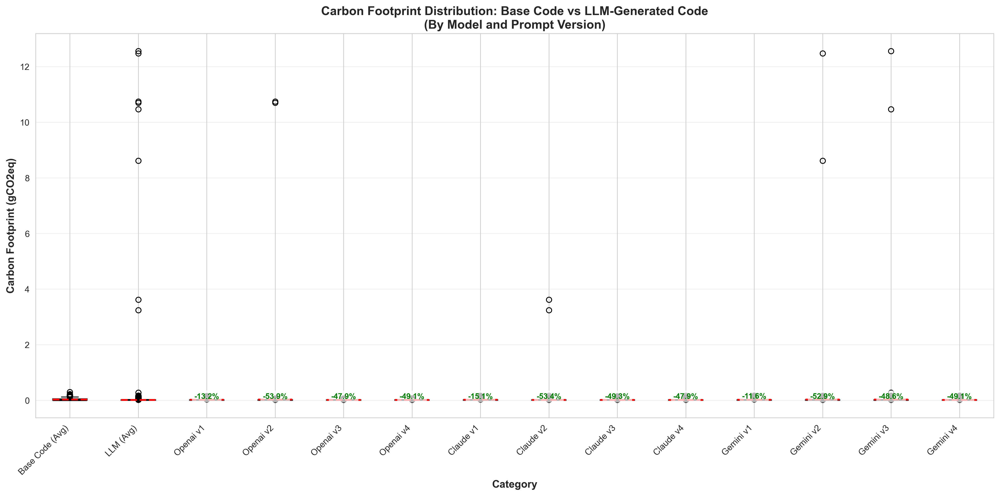
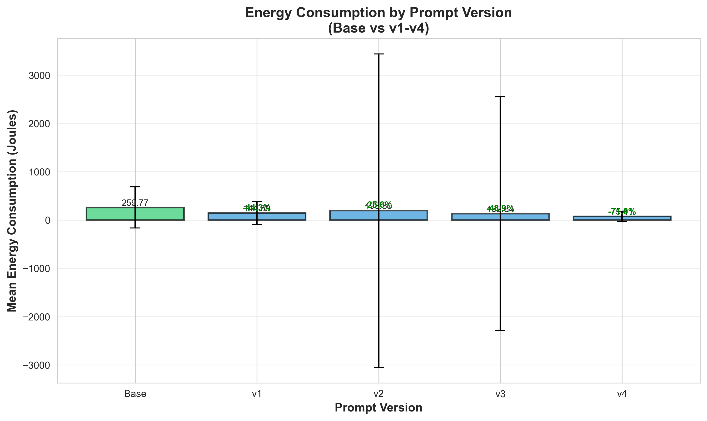
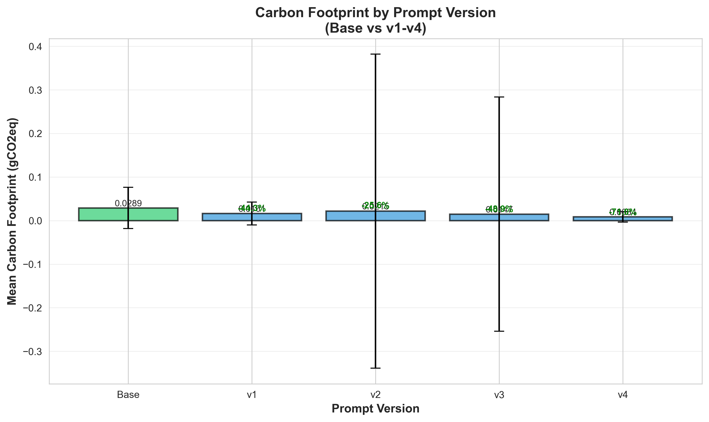
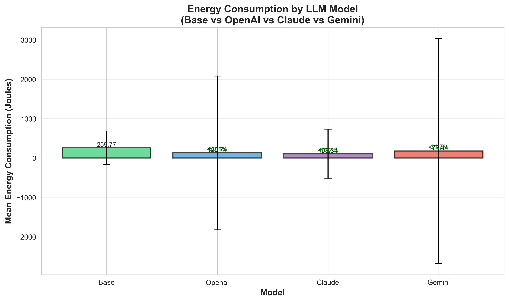
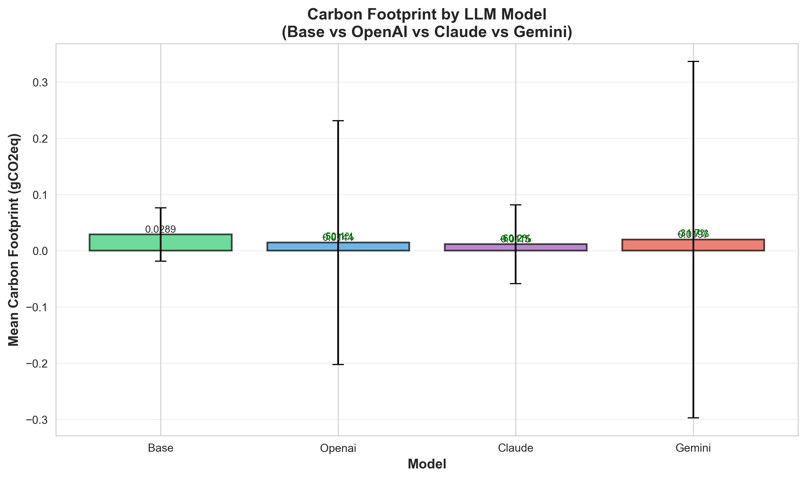
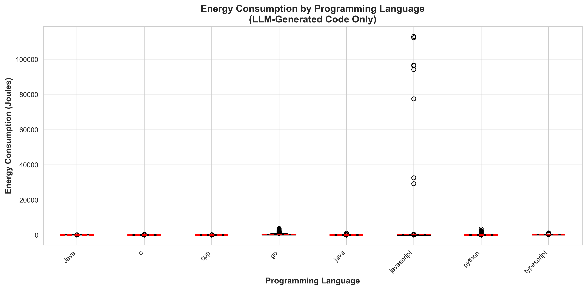
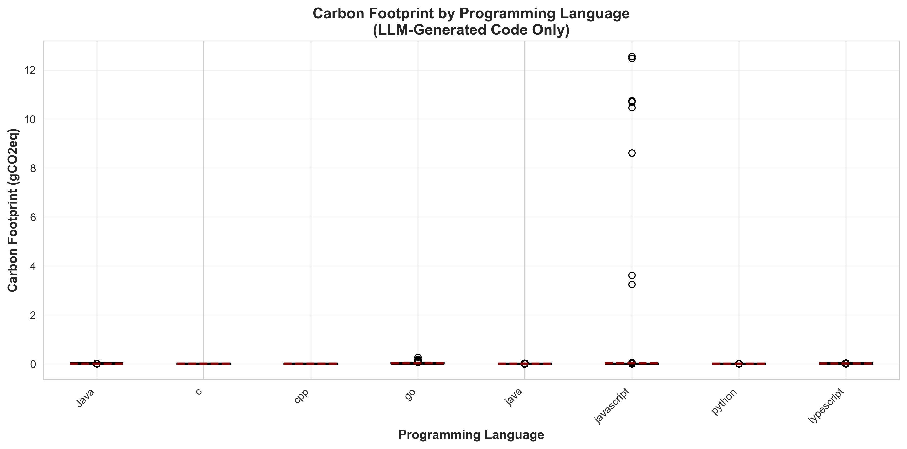

# Energy and Carbon Footprint Analysis Report
**Generated:** energy_improvements
---

## Global Statistics

### Base Code

| Metric | Mean | Median | Std | Min | Max | Count |
|--------|------|--------|-----|-----|-----|-------|
| Energy (J) | 259.77 | 36.28 | 425.98 | 0.04 | 2697.36 | 1563 |
| Carbon (gCO2eq) | 0.0289 | 0.0040 | 0.0473 | 0.0000 | 0.2997 | 1563 |

### LLM-Generated Code

| Metric | Mean | Median | Std | Min | Max | Count |
|--------|------|--------|-----|-----|-----|-------|
| Energy (J) | 136.63 | 71.29 | 2022.35 | 0.02 | 113048.83 | 14916 |
| Carbon (gCO2eq) | 0.0152 | 0.0079 | 0.2247 | 0.0000 | 12.5610 | 14916 |

### Improvements (LLM vs Base)

| Metric | Mean | Median | Std | Min | Max |
|--------|------|--------|-----|-----|-----|
| Energy Improvement (%) | 1923.83 | -37.76 | 26273.32 | -99.87 | 1256838.92 |
| Carbon Improvement (%) | 1923.83 | -37.76 | 26273.32 | -99.87 | 1256838.92 |

**Note:** Negative improvement indicates reduction (better for sustainability).

## Results by LLM Model

| Model | Energy Mean (J) | Carbon Mean (gCO2eq) | Energy Impr (%) | Carbon Impr (%) |
|-------|-----------------|----------------------|-----------------|------------------|
| openAI | 129.74 | 0.0144 | 1884.66 | 1884.66 |
| claude | 103.34 | 0.0115 | 1513.62 | 1513.62 |
| gemini | 177.44 | 0.0197 | 2380.55 | 2380.55 |

## Results by Prompt Version

| Prompt | Energy Mean (J) | Carbon Mean (gCO2eq) | Energy Impr (%) | Carbon Impr (%) |
|--------|-----------------|----------------------|-----------------|------------------|
| v1 | 144.59 | 0.0161 | 1051.97 | 1051.97 |
| v2 | 193.30 | 0.0215 | 2942.02 | 2942.02 |
| v3 | 132.64 | 0.0147 | 2213.25 | 2213.25 |
| v4 | 75.41 | 0.0084 | 1523.50 | 1523.50 |

## Visualizations

### Energy and Carbon Distribution





### Analysis by Prompt Version





### Analysis by Model





### Analysis by Programming Language





---

## Methodology

### Energy Calculation Formula

```
1. exec_time_sec = exec_time_ms / 1000
2. cpu_power_watt = TDP_CPU * (CPU_usage% / 100)
3. ram_power_watt = (RAM_KB / 1048576) * POWER_PER_GB_RAM
4. total_power = (cpu_power + ram_power) * PUE_FACTOR
5. energy_joules = total_power * exec_time_sec
```

### Carbon Calculation Formula

```
1. energy_kwh = energy_joules / 3,600,000
2. carbon_gco2eq = energy_kwh * CARBON_INTENSITY
```

### Coefficients Used

- **TDP_CPU_WATT:** 95.0 W (typical desktop CPU)
- **POWER_PER_GB_RAM_WATT:** 0.375 W/GB (DDR4 average)
- **PUE_FACTOR:** 1.5 (data center efficiency)
- **CARBON_INTENSITY:** 400.0 gCO2eq/kWh (EU average)

**Note:** These values are configurable in `energy_config.json`.
